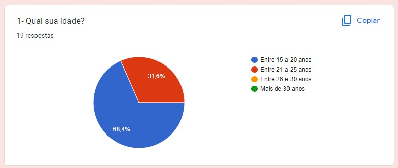
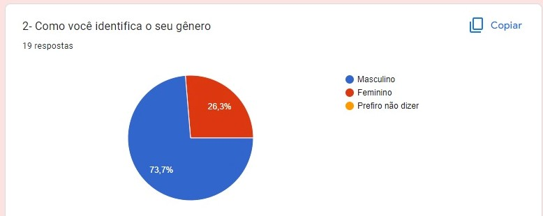
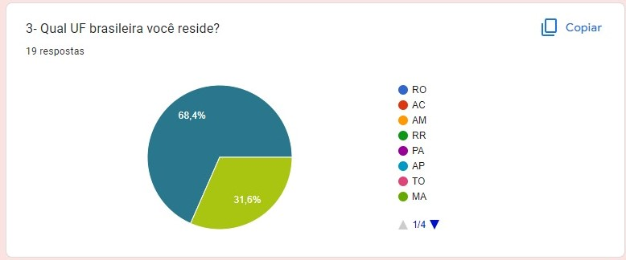
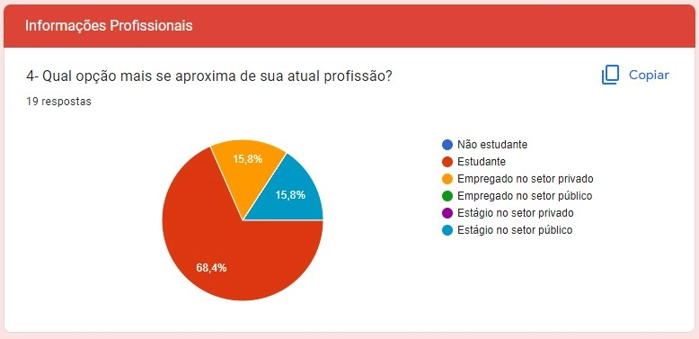
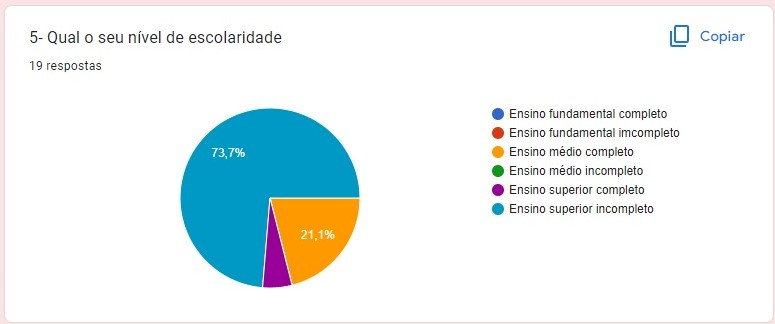
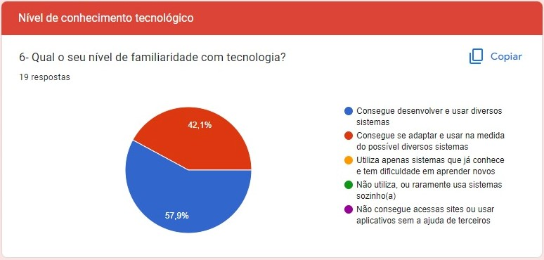
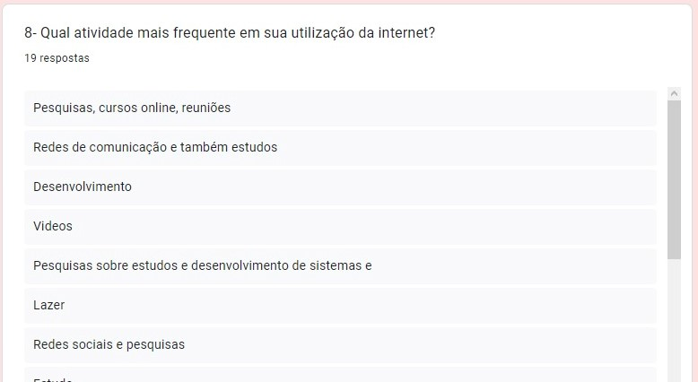
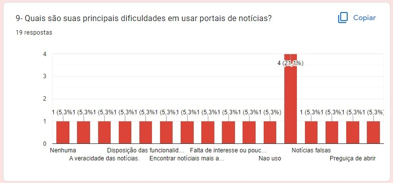
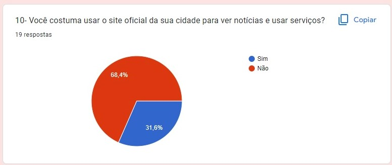

# Perfil de Usuário 

Como parte essencial do desenvolvimento do projeto, definir um perfil de usuário é importante para que se possa entender mais sobre os usuários que utilizarão o sistema, deve-se levar em consideração diversas características como: interesse, experiência, faixa etária, conhecimento prévio e entre outros. 
Tendo em mente que não devemos nos concentrar em apenas subgrupos restritos de usuários como: os "mais experientes" ou "melhores" [1]. Sendo assim levando em consideração que o site analisado se trata de um site oficial de uma prefeitura local, foi realizado um simples questionário para levantar alguns dados do público alvo.

## Resultados do questionário

### Dados demográficos 
 

<figcaption align='center'>
 <h6> <b>Imagem 1 – Gráfico com o percentual de respostas da questão 1</b> 
  Fonte: Elaboração Própria</h6>
</figcaption>

<figcaption align='center'>
 <h6> <b>Imagem 2 – Gráfico com o percentual de respostas da questão 2</b> 
  Fonte: Elaboração Própria</h6>
</figcaption>

<figcaption align='center'>
 <h6> <b>Imagem 3 – GGráfico com o percentual de respostas da questão 3</b> 
  Fonte: Elaboração Própria</h6>
</figcaption>

### Informações Profissionais
 

<figcaption align='center'>
 <h6> <b>Imagem 4 – Gráfico com o percentual de respostas da questão 4</b> 
  Fonte: Elaboração Própria</h6>
</figcaption>

<figcaption align='center'>
 <h6> <b>Imagem 5 – Gráfico com o percentual de respostas da questão 5</b> 
  Fonte: Elaboração Própria</h6>
</figcaption>

### Nível de conhecimento tecnológico
 

<figcaption align='center'>
 <h6> <b>Imagem 6 – Gráfico com o percentual de respostas da questão 6</b> 
  Fonte: Elaboração Própria</h6>
</figcaption>

<figcaption align='center'>
 <h6> <b>Imagem 7 – Gráfico com o percentual de respostas da questão 7</b> 
  Fonte: Elaboração Própria</h6>
</figcaption>

<figcaption align='center'>
 <h6> <b>Imagem 8 – Algumas das respostas da questão 8</b> 
  Fonte: Elaboração Própria</h6>
</figcaption>

<figcaption align='center'>
 <h6> <b>Imagem 9 – Gráfico com o percentual de respostas da questão 9</b> 
  Fonte: Elaboração Própria</h6>
</figcaption>

<figcaption align='center'>
 <h6> <b>Imagem 10 – Gráfico com o percentual de respostas da questão 10</b> 
  Fonte: Elaboração Própria</h6>
</figcaption>

## Perfil de Usuário

Na pesquisa feita a maioria dos entrevistados possuem de 15 a 25 anos e são estudantes do ensino superior. O uso mais comum da internet é para pesquisas de estudo, redes sociais e consumo de vídeos e entreterimento. É importante observar que a maioria disse não usar o site oficial da sua cidade como fonte de notícias ou algum serviço que o site disponibiliza, outro detalhe importante é que a principal plataforma utilizado é o celular, seguido por computador de mesa e por último notebook. Com base nisso iremos definir o nosso perfil de usuário. 

## Referências:

[1] BARBOSA, Simone; DINIZ, Bruno. Interação Humano-Computador. Editora Elsevier, Rio de Janeiro, 2010.

Repositórios de semestre anteriores que serviram de grande ajuda para essa documentação: 

- https://interacao-humano-computador.github.io/2020.1-SEI/#/./use_context/user_profiles?id=informações-demográficas

- https://github.com/Interacao-Humano-Computador/2020.2-Ingresso.eear/blob/main/docs/analise-de-requisitos/perfil-do-usuario.md

## Versionamento

| Data  | Versão |     Descrição     |    Autor    |
|:-----:|:------:|:-----------------:|:-----------:|
| 17/07 |   v0   | Criação da página e conteúdo | [Renann](https://github.com/NyndoND) |
| 20/07 |   v1.0   | Públicação dos resultados da pesquisa | [Renann](https://github.com/NyndoND) |
