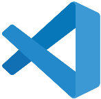

# Ferramentas Utilizadas

| Ferramenta                                           | Nome                                                                                  | Descrição                                                                                            |
|------------------------------------------------------|---------------------------------------------------------------------------------------|------------------------------------------------------------------------------------------------------|
|            | [GitHub](https://github.com)                                                          | Plataforma de versionamento em que iremos armazenar todos os arquivos relacionados ao projeto        |
|              | [Microsoft Teams](https://www.microsoft.com/pt-br/microsoft-365/microsoft-teams/free) | Plataforma usada para a gravação das apresentações do projeto                                        |
|        | [Whatsapp](https://www.whatsapp.com)                                                  | Ferramenta de comunicação rápida entre os integrantes do grupo                                       |
|  | [VSCode](https://code.visualstudio.com/)                                              | Editor de código destinado ao desenvolvimento de aplicações com controle Git incorporado             |
|        | [Intellij](https://www.jetbrains.com/idea/)    | Editor de código alternativo destinado ao desenvolvimento de aplicações com controle Git incorporado |
|        | [Discord](https://discord.com)   | Software de comunicação por voz e vídeo |
|        | [Figma](https://www.figma.com)    | Plaforma de prototipação e design de interfaces |

## Versionamento

| Data  | Versão |                   Descrição                    |    Autor    |
|:-----:|:------:|:----------------------------------------------:|:-----------:|
| 08/07 |   v0   | Criação da página, com as ferramentas iniciais | Tiago Buson |
| 13/07 |   v0.1   | Adição de outras ferramentas | Renann |
