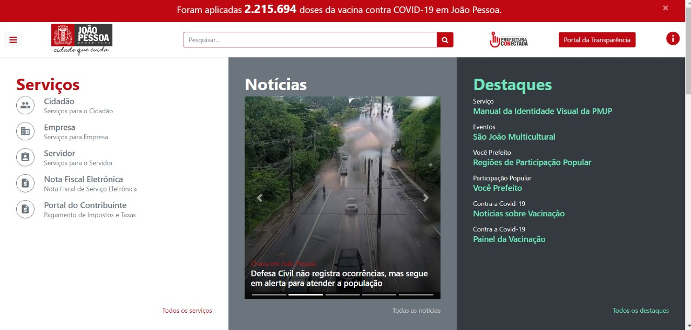
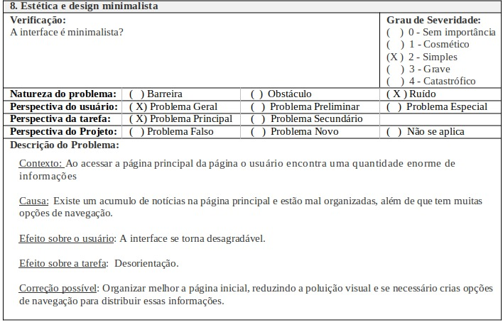

# Site Escolhido

## Objetivos (Determine)

Os principais objetivos da avaliação são: Procurar possíveis erros na interação do usuário com o site, verificar a clareza com que o site expõe as informações ao usuário e a simplicidade da navegação.

Por ser um site da prefeitura é de suma importância que a plataforma tenha uma excelente usabilidade e acessibilidade pois o público alvo é toda uma população de uma região.

## Perguntas a serem respondidas (Explore)

Perguntas que foram selecionadas do livro (Barbosa et al., INTERAÇÃO HUMANO- COMPUTADOR E EXPERIÊNCIA DO USUÁRIO. página 298).

- O usuário consegue operar o sistema?

- Que parte da interface e da interação o deixa insatisfeito?

- Ele entende o que significa e para que serve cada elemento de interface?

- Ele vai entender o que deve fazer em seguida?

- Que problemas de IHC dificultam ou impedem o usuário de alcançar seus objetivos?

- Quais barreiras o usuário encontra para atingir seus objetivos?

## Método de Avaliação (Choose)

Tendo em mente os objetivos propostos o método escolhido foi o de inspeção, buscando possíveis falhas ao longo da interação do usuário, é um método um tanto simples e de baixo custo, por não depender de usuários. Por meio do método de inspeção utilizaremos a avaliação heurística, de Nielsen.

É um método de avaliação de IHC criado para encontrar problemas de usabilidade durante um processo de design iterativo (Nielsen e Molich, 1990), esse método possui um conjunto inicial de problemas de usabilidade, algum deles são: consistência e padronização, reconhecimento em vez de memorização, projeto estético e minimalista.

## Questões Práticas(Identify)

Em relação a questões práticas, foi utilizado um computador Intel i5-10400F, 8gb de Ram e uma internet com velocidade de 240Mb/s.

## Questões Éticas (Decide)

Devido o método utilizado ser o de avaliação heurística, o cuidado ético em relação ao assunto não se mostra necessário, pois não há contato direto com os usuários.

Esclarecendo alguns pontos da avaliação heurística de Nielsen, a avaliação será feita por meio do “Formulário para Avaliação Heurística” encontrado no artigo “Avaliação Heurística de Sítios na Web” de Maciel et al, seguindo os dez princípios de usabilidade descritos por Nielsen.

## Avaliação (Evaluate)

Na **Imagem 1** é apresentado um print da tela inicial do site. Como já foi dito no planejamento do projeto, utilizando o método DECIDE só resta a última etapa, que é avaliar, como é feito na **Imagem 2** a seguir:

<h6>Imagem 1 – Página da prefeitura de João Pessoa PB</h6>

<h6>Imagem 2 -  Formulário para Avaliação Heurística – Estética e design minimalista (Exemplo)</h6>

## Referências 

Livro: Interação humano-computador / Simone Diniz Junqueira Barbosa, Bruno Santana da Silva. –Rio de Janeiro: Elsevier, 2010.il. - (Série SBC, Sociedade Brasileira de Computação)

Site: https://www.joaopessoa.pb.gov.br/

## Versionamento

| Data  | Versão |     Descrição      |      Autor      |
|:-----:|:------:|:------------------:|:---------------:|
| 08/07 |   v0   | Criação da página  |   [Tiago Buson](https://github.com/TiagoBuson)   |
| 09/07 |  v0.1  | Adição de conteúdo | [Nicolas Roberto](https://github.com/Nicolas-Roberto) |
