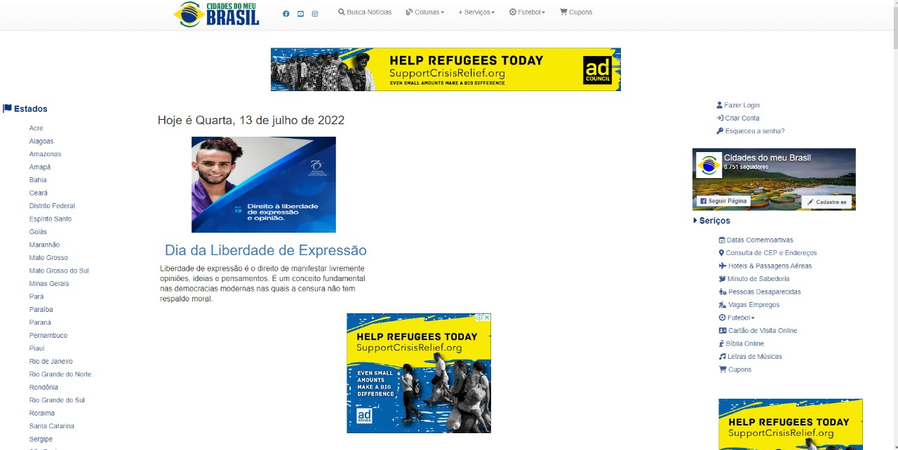
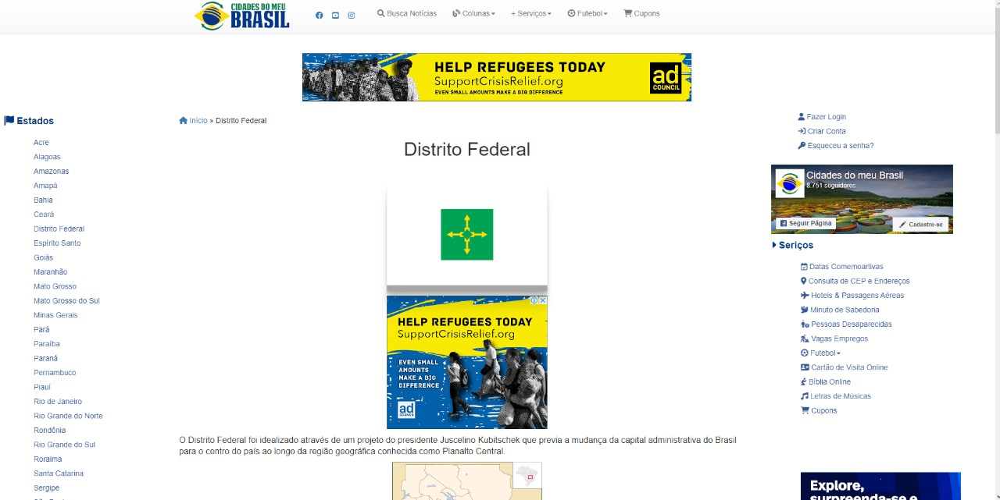

# Site Escolhido

## Cidades do Meu Brasil

   
  
Os principais objetivos da avaliação são: Procurar possíveis erros na interação do usuário com o site, verificar a clareza com que o site expõe as informações ao usuário e a simplicidade da navegação.[1]

Dentre todos os sites avaliados pelos integrantes do grupo, percebeu-se que o portal Cidades do Meu Brasil é o que apresentou mais exemplos claros de problemas de usabilidade e interação humano computador, por mais que ele possa fornecer uma grande quantidade de informações sobre as cidade do Brasil, o processo de realizar tarefas simples é dificultado pela interface mal otimizada.

Por ser um site que possui diversas informações de todas as cidades do Brasil é de suma importância que a plataforma tenha uma excelente usabilidade e acessibilidade pois o público alvo são estudantes e pesquisadores de todo o Brasil. Na *figura 1* é apresentado a página inicial do site e na *figura 2* a página do Estado Distrito Federal com uma breve descrição do Estado e alguns anúncios

Site: https://www.cidadesdomeubrasil.com.br

   
  <figcaption align='center'>
    <b>Figura 1: Tela inicial do Cidades do Meu Brasil.</b> 
    <small>Fonte: https://www.cidadesdomeubrasil.com.br</small>
</figcaption>

   
  <figcaption align='center'>
    <b>Figura 2: Tela do Estado Distrito Federal.</b> 
    <small>Fonte: https://www.cidadesdomeubrasil.com.br/df</small>
</figcaption>

## Referências Bibliográficas

[1] BARBOSA, Simone; DINIZ, Bruno. **Interação Humano-Computador**. Editora Elsevier, Rio de Janeiro, 2010.

## Versionamento

| Data  | Versão |     Descrição      |      Autor      |
|:-----:|:------:|:------------------:|:---------------:|
| 08/07 |   0   | Criação da página  |   [Tiago Buson](https://github.com/TiagoBuson)   |
| 09/07 |  0.1  | Adição de conteúdo | [Nicolas Roberto](https://github.com/Nicolas-Roberto) |
| 14/07 |  0.2  | Revisão de conteúdo | [Renann](https://github.com/NyndoND) |
