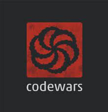

# Sites Avaliados

Esta seção lista as sugestões de sites ecolhidos pelos membros da equipe de forma a escolher o site com as maiores falhas, sendo os seguintes sugeridos:

## Magalu
### Sugestão: Gabrielly Assunção

   

O Magalu foi criado há mais de 60 anos com uma missão: incluir. Contribuir para que bens, até então, acessíveis a uma classe de privilegiados pudessem chegar a todos os brasileiros. Não se trata apenas de consumo, mas da transformação de vidas por meio do acesso.

## OLX
### Sugestão: Paulo Torres

   

OLX é uma empresa global de comércio eletrônico, sediada em Amsterdam, Países Baixos. Presente em 45 países, publicando anúncios classificados na Internet. Foi fundada em março de 2006 pelos empresários Fabrice Grinda e Alejandro Oxenford.

## Havan
### Sugestão: Renann Gomes

   

Fundada em 1986 por Luciano Hang e Vanderlei de Limas, a empresa é conhecida pelas suas lojas com fachadas similares à Arquitetura neogrega e pelas réplicas da Estátua da Liberdade instaladas na frente da maioria das suas filiais. A Havan comercializa artigos nacionais e importados no atacado e no varejo. 

## Codewars
### Sugestão: Tiago Buson

   
  
CodeWars é um site onde você pode evoluir suas habilidades de programação, conhecimento da linguagem e até mesmo aprender uma linguagem nova.

## Prefeitura de João Pessoa
### Sugestão: Nicolas Robesto

   

O site da Prefeitura de João Pessoa contém notícias sobre a cidade, serviços online, informações uteis e sobre secretárias, além de dar acesso ao portal da transparência da cidade.

## Versionamento

| Data  | Versão |     Descrição      |      Autor      |
|:-----:|:------:|:------------------:|:---------------:|
| 08/07 |   V0   | Criação da página  |   Tiago Buson   |
| 09/07 |  V1.0  | Adição de conteúdo | Nicolas Roberto |
